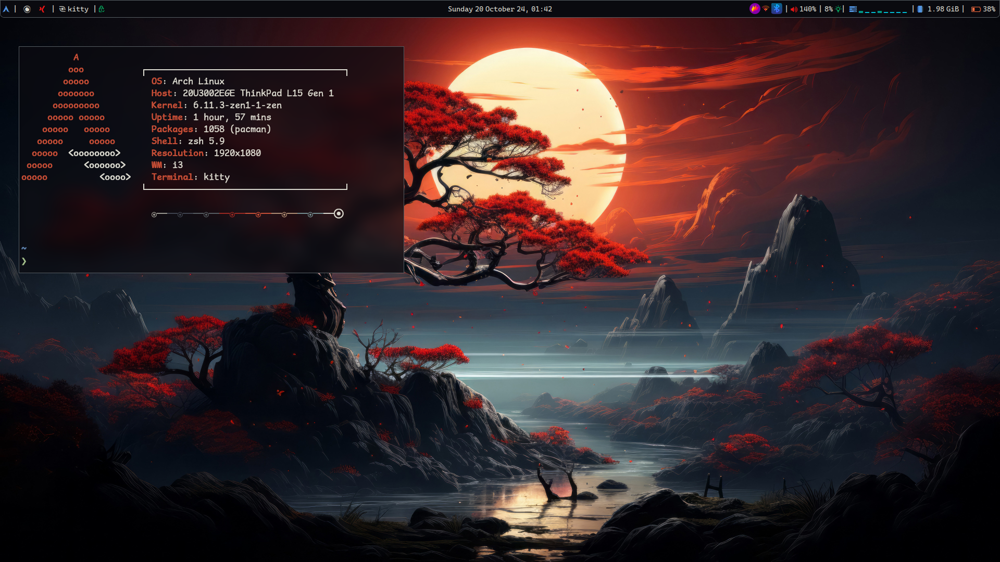
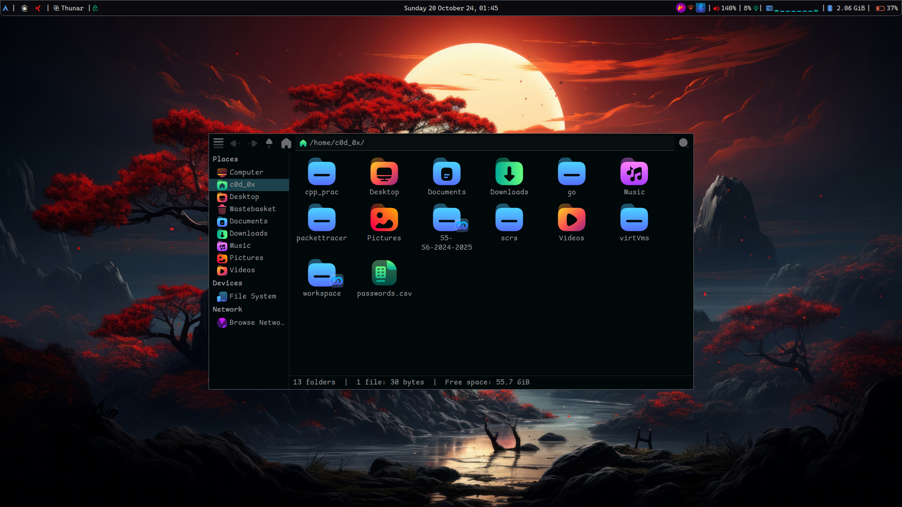
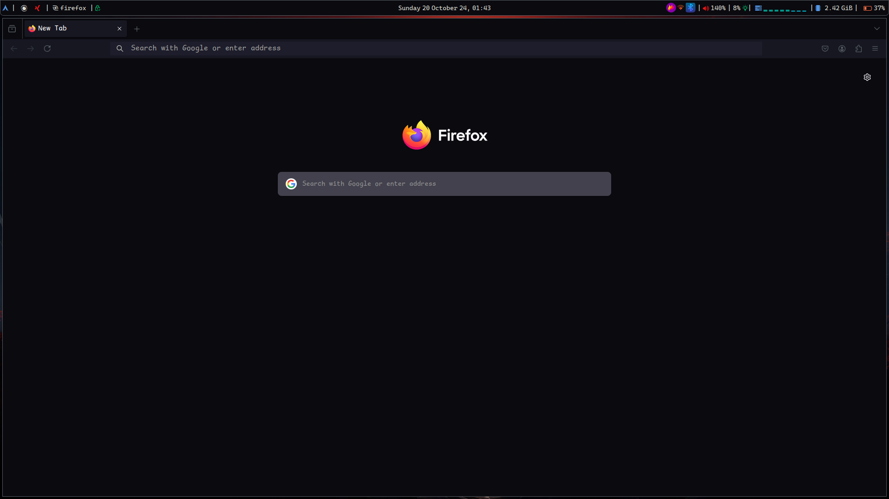

<!--# Archlinux i3-Dotfiles-->
<!---->
<!--This is a collection of my I3-wm dotfiles with installation scripts.-->
<!---->
<!---->
<!---->
<!--# Installation-->
<!--These scaripts are to be ran on a fresh minimal arch-install.-->
<!--```bash-->
<!--git clone https://github.com/c0d-ox/archlinux_i3_dotfiles.git-->
<!--cd archlinux_i3_dotfiles/scripts-->
<!--./main.sh-->
<!--```-->


# c0d-0x's Arch Linux i3 Dotfiles
Welcome to my Arch Linux i3 configuration repository! This repo contains all the dotfiles I use to configure my lightweight and efficient Arch Linux environment with the i3 window manager.

### Introduction
This repository contains dotfiles for setting up a fully functional, minimal, and fast Arch Linux environment with the i3 window manager. It includes configurations for i3, polybar, rofi, and other tools to streamline workflows and enhance the desktop experience.

Installation
To get started with these dotfiles, follow the instructions below:

```bash
# Clone the Repository
git clone https://github.com/c0d-0x/archlinux_i3_dotfiles.git
cd archlinux_i3_dotfiles
```
#### Install the Dotfiles on a fresh minimal arch-install
```bash
cp setup
./setup.sh #This setup should only be ran within the scripts dir
# This scripts run multiple scripts to setup your minamal install by
#installing i3 and  all of it's dependencies. 
```


#### Copy Dotfiles on a existing setup

##### Backup Your Existing Dotfiles
It's a good practice to back up your existing dotfiles before overwriting them:

```bash
mkdir ~/dotfiles_backup
mv ~/.config/i3 ~/.config/polybar ~/.config/rofi ~/dotfiles_backup/
```

```bash
cp -r dotfiles/i3 dotfiles/polybar dotfiles/rofi dotfiles/i3lock ~/.config/
```
##### Reload i3
After installation, reload i3 using:

```bash
$mod+Shift+R

#This will load the new configuration without needing to log out.
```
### Features
+ i3 Window Manager: A highly customizable, tiling window manager.
+ Polybar: A sleek status bar with system information, workspaces, and more.
+ Rofi: A powerful application launcher and window switcher.
+ Picom: A lightweight compositor for transparency and window effects.
+ Custom Keybindings: Optimized shortcuts for efficient workflows.
+ Theming: A minimalist aesthetic with custom colors, fonts, and icons.
+ Color: colors are base on wallpaper store in ~/pictures/wallpapers. These colors are generate using pywal.

### Dependencies
Make sure to install the following packages on your Arch Linux system:

+ i3: `sudo pacman -S i3-wm`
+ thunar: `sudo pacman -S thunar thunar-archive-plugin` (a file manager)
+ Polybar: `sudo pacman -S polybar`
+ Rofi: `sudo pacman -S rofi`
+ Picom: `yay -S picom-git` 
+ Feh: `sudo pacman -S feh` (for setting wallpapers)
+ Dunst: `sudo pacman -S dunst` (for notifications)
+ kitty: `sudo pacman -S kitty` (terminal emulator)
+ yay: Install yay with the Commands below. [Learn more...](https://github.com/Jguer/yay)
```bash 
sudo pacman -S --needed git base-devel
git clone https://aur.archlinux.org/yay.git
cd yay
makepkg -si

# Install brightnessct, python-pywal and python-pywalfox for Firefox pywal themes brightness controls
yay -S brightnessctl python-pywal python-pywalfox xdg-user-dirs xdg-utils xorg-xrdb
# IMPORTANT for i3 polywal colours: xorg-xrdb

```

### Screenshots
Here are a few screenshots of my Arch Linux i3 setup:


Desktop with Polybar and Thunar: GTK theme: [Abyss-DEEP](https://github.com/rtlewis1/GTK/tree/Abyss-Desktop) and icons: [BeautySolar](https://www.gnome-look.org/p/2037657)



Firefox pywal-fox theme: You'll need to install the `pywalfox` plugin for firefox. [here](https://addons.mozilla.org/en-US/firefox/addon/pywalfox/)



### Customization
Feel free to modify the following files to suit your preferences:

+ i3 configuration: ~/.config/i3/config
+ Polybar: ~/.config/polybar/config
+ Rofi: ~/.config/rofi/config.rasi
+ Picom: ~/.config/picom/picom.conf
+ kitty: ~/.config/kitty/kitty.conf

# Keybindings

Below is a list of keybindings used in this i3 configuration. The **SUPER** key is the **Windows** key.

| Key Combination          | Action                                      |
|--------------------------|---------------------------------------------|
| **SUPER+Return**         | Launch `kitty` terminal.                   |
| **SUPER+q**              | Kill the focused window.                   |
| **SUPER+d**              | Launch `rofi` application launcher.        |
| **SUPER+k/h/j/l**        | Change focus (up/left/down/right).         |
| **SUPER+Up/Down/Left/Right** | Change focus using arrow keys.           |
| **SUPER+Shift+k/h/j/l**  | Move focused window (up/left/down/right).  |
| **SUPER+Shift+Up/Down/Left/Right** | Move focused window using arrow keys. |
| **SUPER+b**              | Split in horizontal orientation.           |
| **SUPER+v**              | Split in vertical orientation.             |
| **SUPER+f**              | Toggle fullscreen mode.                    |
| **SUPER+e**              | Toggle split layout.                       |
| **SUPER+s**              | Change layout to tabbed.                   |
| **SUPER+Shift+space**    | Toggle floating mode.                      |
| **SUPER+space**          | Toggle focus between tiling/floating.      |
| **SUPER+a**              | Focus the parent container.                |
| **SUPER+1...0**          | Switch to workspace 1–10.                  |
| **SUPER+Shift+1...0**    | Move container to workspace 1–10.          |
| **SUPER+Shift+c**        | Reload i3 configuration.                   |
| **SUPER+Shift+r**        | Restart i3.                                |
| **SUPER+Shift+e**        | Exit i3 (with confirmation prompt).        |

## Resize Mode Keybindings
| Key Combination          | Action                                      |
|--------------------------|---------------------------------------------|
| **SUPER+r**              | Enter resize mode.                         |
| **h/j/k/l**              | Resize (shrink/grow width/height).         |
| **Left/Down/Up/Right**   | Resize using arrow keys.                   |
| **Return/Escape/SUPER+r**| Exit resize mode.                          |

## Multimedia and System Keybindings
| Key Combination          | Action                                      |
|--------------------------|---------------------------------------------|
| **XF86AudioMute**        | Mute audio.                                |
| **XF86AudioLowerVolume** | Decrease audio volume by 5%.               |
| **XF86AudioRaiseVolume** | Increase audio volume by 5%.               |
| **XF86AudioMicMute**     | Toggle microphone mute.                    |
| **XF86MonBrightnessUp**  | Increase screen brightness by 5%.          |
| **XF86MonBrightnessDown**| Decrease screen brightness by 5%.          |
| **Print**                | Take a screenshot of a selected area.      |

## Custom Keybindings
| Key Combination          | Action                                      |
|--------------------------|---------------------------------------------|
| **SUPER+t**              | Launch `thunar` file manager.              |
| **SUPER+x**              | Move window to the scratchpad.             |
| **SUPER+Shift+X**        | Show scratchpad window.                    |
| **SUPER+Tab**            | Switch to the next workspace.              |
| **SUPER+Shift+Tab**      | Switch to the previous workspace.          |
| **SUPER+Shift+F**        | Launch `firefox`.                          |
| **SUPER+p**              | Quit `polybar`.                            |
| **SUPER+Ctrl+L**         | Lock the screen.                           |
| **SUPER+w**              | Change wallpaper.                          |
| **SUPER+Ctrl+P**         | Launch power menu.                         |
| **SUPER+c**              | Open clipboard manager (`rofi`).           |


### Contributing
If you have any suggestions or improvements, feel free to open an issue or submit a pull request. Contributions are always welcome!

### License
This repository is licensed under the MIT License. See the LICENSE file for more details.
